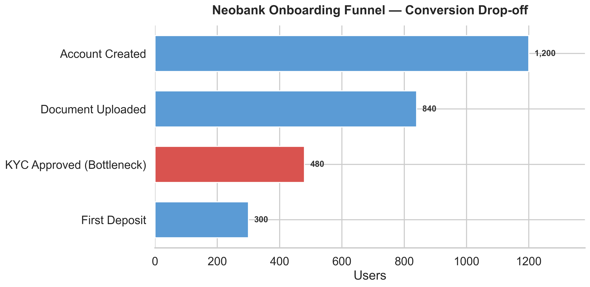
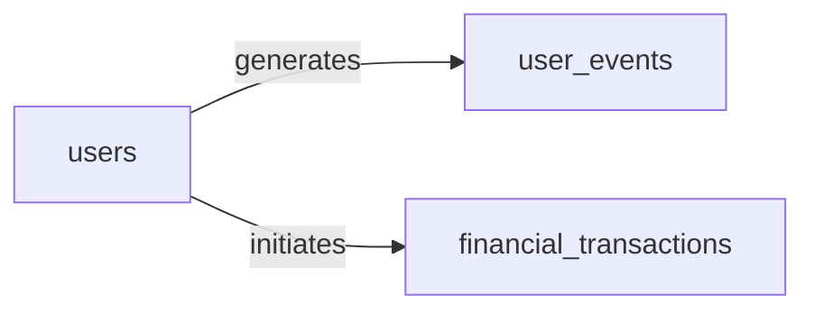

# 🏦 Neobank Onboarding Analytics: Funnel Drop-off & Revenue Leakage


## 📉 Executive Dashboard Overview

[](https://public.tableau.com/views/planilha1_17894949408060/Painel1?:language=pt-BR&publish=yes&:sid=&:redirect=auth&:display_count=n&:origin=viz_share_link)

Interactive Tableau Public dashboard with the full onboarding funnel, KYC cohort trends, and acquisition-channel breakdown. The workbook file (**Planilha 1** / `dashboards/planilha1.twb`) is also saved locally in this repository for offline review and iteration.



## 📌 Executive Summary
This project evaluates the end-to-end user onboarding conversion funnel for a digital banking platform to identify operational friction and quantify lost liquidity. Analyzing **1,200 user journeys** over a 6-month period using **PostgreSQL**, **Docker**, and **Python**, I uncovered that the **KYC (Know Your Customer) document verification phase represents the primary bottleneck**, with a drop-off rate of **42.86%**. This friction resulted in **360 qualified users abandoning onboarding**, translating to an estimated **$393,175 in lost initial deposit volume**.

---

## 🎯 Business Problem & Questions Answered
The Growth and Product leadership teams observed strong sign-up volume driven by digital ad campaigns, but a steep conversion drop before account activation. The objective of this SQL-driven analysis was to answer:
1. **At which exact milestone in the onboarding funnel are potential users dropping off?**
2. **What is the direct financial impact ($ lost liquidity) caused by document verification delays?**
3. **What product and automation strategies should be prioritized to shorten Time-to-Value (TTV)?**

---

## 🏗️ Relational Schema & Architecture
The analysis relies on a transactional relational schema hosted in a containerized **PostgreSQL 15** environment:



| Table | Key columns |
|---|---|
| `users` | `user_id` (PK), `signup_timestamp`, `acquisition_channel`, `user_segment` |
| `user_events` | `event_id` (PK), `user_id` (FK), `event_name`, `event_timestamp` |
| `financial_transactions` | `transaction_id` (PK), `user_id` (FK), `transaction_type`, `amount`, `status` |

---

## 📊 Key Analytical Findings

| Funnel Milestone | User Count | Step Conversion Rate | Cumulative Conversion | Key Insight / Status |
|---|---|---|---|---|
| 1. Sign-up (Account Created) | 1,200 | 100.00% | 100.00% | Initial user acquisition baseline |
| 2. Document Uploaded | 840 | 70.00% | 70.00% | Strong initial user intent |
| 3. KYC Approved | 480 | 57.14% | 40.00% | 🔴 Primary Bottleneck (42.86% drop-off) |
| 4. First Deposit Initiated | 300 | 62.50% | 25.00% | Overall end-to-end conversion rate |

## 💰 Financial Leakage Analysis
- **Users Lost at KYC Stage:** 360 users uploaded identity documents but never completed verification.
- **Average Deposit per Converted User:** ~$1,092.15
- **Estimated Lost Liquidity Volume:** ~$393,175.00

## ⏱️ Time-to-Value (TTV) Bottlenecks
- **document_uploaded → kyc_approved:** High variance indicating manual review queue delays.
- **kyc_approved → first_deposit_initiated:** Slowest transition averaging ~168 hours (~7 days), showing that user intent cools off post-approval if not engaged immediately.

## 💡 Strategic Recommendations
- **Implement Automated Instant OCR Verification:** Replace manual document review queues with instant optical character recognition (OCR) and automated biometric checks to improve the 57.14% KYC conversion rate.
- **Real-Time Remediation Prompts:** Introduce in-app notifications if uploaded documents are blurry or invalid, preventing permanent user abandonment at stage 2.
- **Post-Approval Activation Nudges:** Trigger automated SMS/Email reminders 24 to 48 hours post-KYC approval for users who haven't initiated an initial deposit to reduce the 7-day TTV lag.

## 🛠️ Technical Skills Demonstrated
- **Advanced SQL:** Common Table Expressions (CTEs), Aggregations, Ratio Metrics, Conditional Aggregation, LAG() / LEAD() / FIRST_VALUE() Window Functions for cohort MoM deltas and channel benchmarking.
- **Data Modeling:** Star Schema design, foreign key integrity, and conditional checks.
- **Product Analytics:** Cohort KYC health by signup month and acquisition-channel funnel retention.
- **DevOps Containerization:** Docker Compose setup with healthcheck and automated script ingestion.

## 🚀 How to Run Locally

```bash
# 1. Start the PostgreSQL Container
docker compose up -d

# 2. Install Python Dependencies & Ingest Data
pip install -r requirements.txt
python3 scripts/generate_data.py

# 3. Execute the SQL Funnel Analysis
docker exec -i fintech_growth_db psql -U admin -d fintech_growth < sql/02_funnel_analysis.sql
```
